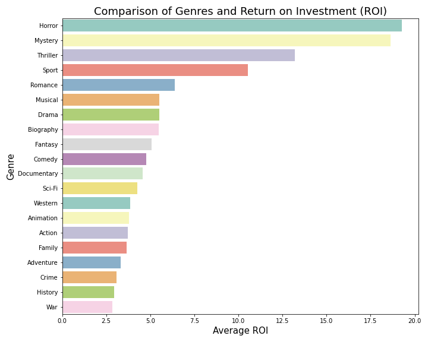
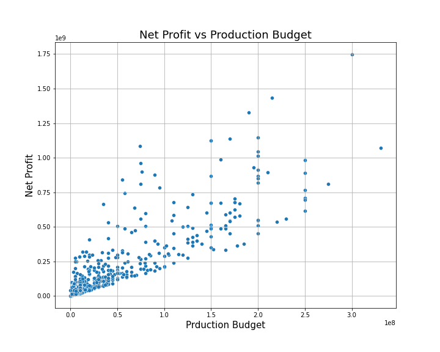

# Microsoft Movie Studio Analysis - Dsc Phase 1 Project


##### Author: Matilda Odalo

## Overview
***
The Microsoft project aims to evaluate the practicability of establishing a movie studio by analyzing data on movie ratings, movie titles, budgets, genres, gross revenues, and various movie studios. This analysis allows for a deeper understanding of the types of movies that have the highest potential for generating substantial gross revenues and a high return on investment(ROI).

In this document, we will identify the significant opportunities that lie ahead in the film market. By examining the trends, patterns, and success factors within the industry, we will provide actionable recommendations on how Microsoft can effectively penetrate the film market and position itself for success. The insights and strategic guidance will enable Microsoft to make informed decisions regarding movie production, resource allocation, and potential partnerships, ensuring a strong foothold in the dynamic and rewarding film industry.

### Business Problem
***
The problem at hand is to determine the viability of Microsoft establishing a movie studio. The objective is to analyze various data points such as movie ratings, budgets, genres, and gross revenues to gain insights into the factors that contribute to the success and profitability of movies and movie studios. By understanding the types of movies that have the potential to generate substantial gross revenues and a high return on investment (ROI), Microsoft can make informed decisions about entering the competitive film market. The goal is to provide actionable recommendations on how Microsoft can effectively penetrate the film market, allocate resources wisely, and potentially form strategic partnerships. Ultimately, the aim is to position Microsoft for success in the dynamic and rewarding film industry.

The questions to be answered by this analysis include:

- What are the most prevalent movie genres?
-  What are the top 5 highest-rated movie genres?
- Which genres tend to have the highest Return on Investment (ROI), and which genres tend to have the lowest Return on Investment (ROI)?
- What is the distribution of net profit across different movie genres, and are there any genres that consistently tend to generate higher net profits than others?
-  Is there a correlation between the production budget and the net profit?
- Which movie studios have generated the highest net profit?
- Which genres are most frequently produced by the top 4 movie studios with the highest net profit?

### Data 
***
The zippedData Folder contains the data sets used in analysis from:
- [Box Office Mojo](https://www.boxofficemojo.com/)
- [IMDB](https://www.imdb.com/)
- [Rotten Tomatoes](https://www.rottentomatoes.com/)
- [TheMovieDB](https://www.themoviedb.org/)
- [The Numbers](https://www.the-numbers.com/)  

The 'index.ipynb' file is the notebook that contains EDA conducted on the datasets.
The datasets used explicitly in the data analysis are:
- title_ratings.csv
- tn.movie_budgets.csv
- bom.movie_gross.csv
- title.basics.csv
 
The 'images' folder contains the images used in the presentation and notebook.
'presentation.pdf' is a non-technical presentation of the analysis

### Methods
***
Exploratory Data Analysis(EDA) includes data cleaning, merging, and visualization.
The used data sets were loaded into the 'notebook' cleaned, merged and irrelevant columns dropped. Visualizations were made to fit the questions as stated above and give recommendations.
In depth, data cleaning includes dealing with missing values and extraneous data, identifying duplicates, converting the values into the correct data types, dropping unnecessary columns, and merging data sets.
### Results
![moviecountpergenre]


![averageratingvsgenre]


![averageROIvsgenre]


![netprofit vs genre]


![genre_distribution]


![netprofitvsbudget]


![budget_and_profit]


### Recommendations
***
From the results of my analysis, the following recommendations were derived:
- Prioritize making movies in the Adventure, Action, Comedy, and Drama genres, as they have demonstrated higher net profit potential.
-Microsoft should focus on producing movies in the Drama, Comedy, Adventure, and Action genres as they hold greater audience appeal.
-Boosted Budgets, Bigger Returns: Higher film budgets enable improved production values.
-Strategic Partnerships: seeking collaborations with movie studios like Universal, Buena Vista, and Warner Bros to boost market reach and profitability.
-Exploring untapped genres: taking a risk and venturing into movie genres with fewer productions.


### Conclusion
***
Microsoft should prioritize genres like Drama, Comedy, Adventure, and Action for higher profits.


Investing in higher-budget productions and effective marketing strategies will attract a larger audience. 


Be mindful of industry risks and stay adaptable to changing trends for long-term profitability. Leverage brand strength and partnerships for success.

## Repository Structure

```
├── images
├── zippedData
├── .gitignore
├── student.ipynb
├── Microsoft-Movie-Analysis-Presentation.pdf
└── README.md
```
	
